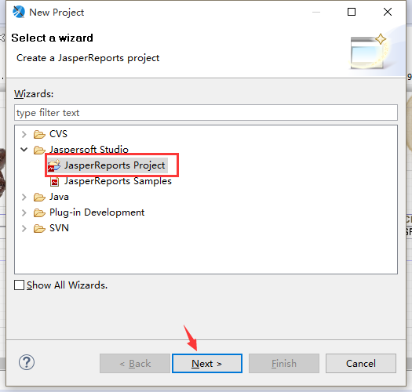
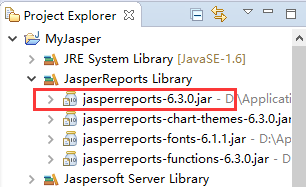
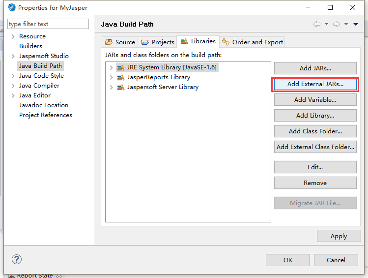
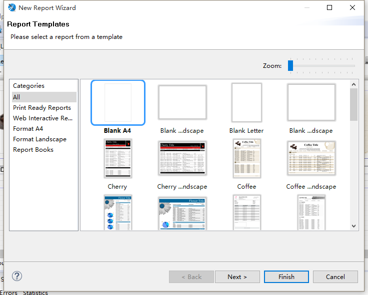
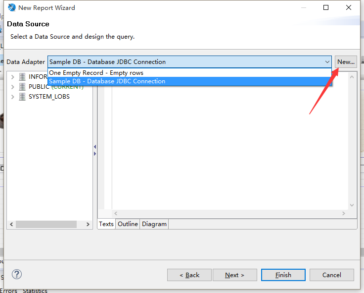
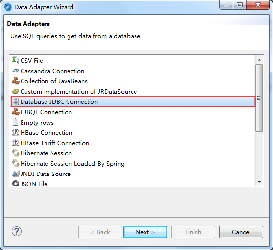
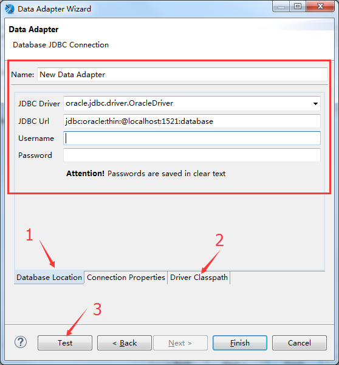
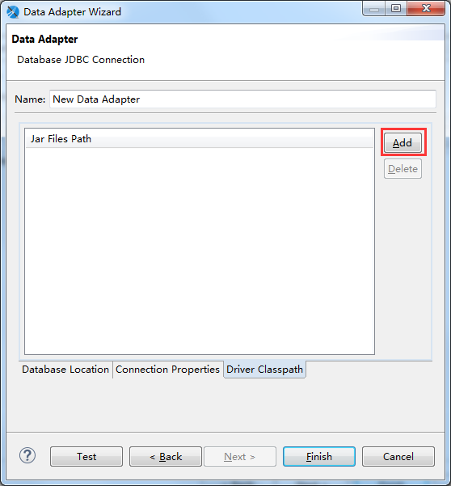
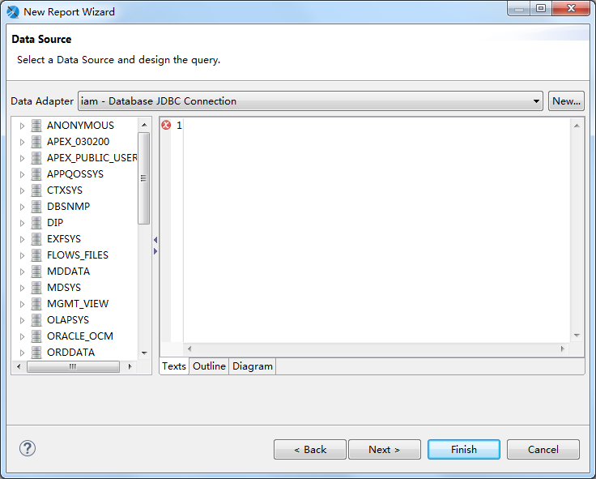

# <center> jasperreport总结 </center>
## 杂


## 操作步骤
- 直接使用jasper studio编辑好的.jasper文件
  1. 用jasper studio编辑.jrxml文件文件生成.jasper文件（报表模板）
  - 将.jasper模板加入项目工程中，通过jasperreport提供的库类填充报表，输出到浏览器或导出
- 手动拼装.jrxml文件
  1. 根据配置手动拼装出.jrxml文件（不用输出保存）  
  - 利用jasperreport提供的库类编译.jrxml文件生成.jasper文件
  - 通过jasperreport提供的库类填充报表，输出到浏览器或导出

## 演示
**jasper studio绘制报表**
1. 安装jasper studio  
    界面比ireport简洁大方

- 新建工程  
    基于Eclipse，所以跟Eclipse一样

- 添加jar包  
    若是在Eclipse的项目中，需要添加以下jar包：  
      jasperreport
      itext
      itext-Asian
    而jasper studio中自带jasperreport包  
      
    只需添加另外2个  
      

- 新建模板  

- 添加数据源  





附：sql示例  
```sql
select m.unitid,
       m.name as UNITNAME,
       sum(decode(t.metadataid, 'ggws_et_xsesl', t.metadatavalue, 0)) as xsr,
       sum(decode(t.metadataid, 'ggws_et_1setsl', t.metadatavalue, 0)) as firsts,
       sum(decode(t.metadataid, 'ggws_et_2setsl', t.metadatavalue, 0)) as twos,
       sum(decode(t.metadataid, 'ggws_et_3setsl', t.metadatavalue, 0)) as threes,
       sum(decode(t.metadataid, 'ggws_et_4setsl', t.metadatavalue, 0)) as fours,
       sum(decode(t.metadataid, 'ggws_et_5setsl', t.metadatavalue, 0)) as fives,
       sum(decode(t.metadataid, 'ggws_et_6setsl', t.metadatavalue, 0)) as sixs,
       sum(decode(t.metadataid, 'ggws_et_7setsl', t.metadatavalue, 0)) as sevens
  from ps025_unit m
  left join METADATAVALUE_GW02_ET t
    on m.id = t.unitid
   and t.statdate between to_date('2016-7-1', 'yyyy-mm-dd') and
       to_date('2016-10-1', 'yyyy-mm-dd')
 where 1 = 1
   and pid = (select n.id from ps025_unit n where unitid = '440100000000')
 group by m.unitid, m.name
 order by m.unitid
```
```sql
select m.ORGID,
       m.MANAGERORGNAME as UNITNAME,
       sum(decode(t.metadataid, 'ggws_et_xsesl', t.metadatavalue, 0)) as xsr,
       sum(decode(t.metadataid, 'ggws_et_1setsl', t.metadatavalue, 0)) as firsts,
       sum(decode(t.metadataid, 'ggws_et_2setsl', t.metadatavalue, 0)) as twos,
       sum(decode(t.metadataid, 'ggws_et_3setsl', t.metadatavalue, 0)) as threes,
       sum(decode(t.metadataid, 'ggws_et_4setsl', t.metadatavalue, 0)) as fours,
       sum(decode(t.metadataid, 'ggws_et_5setsl', t.metadatavalue, 0)) as fives,
       sum(decode(t.metadataid, 'ggws_et_6setsl', t.metadatavalue, 0)) as sixs,
       sum(decode(t.metadataid, 'ggws_et_7setsl', t.metadatavalue, 0)) as sevens
  from ps005_org m
  left join METADATAVALUE_GW02_ET t
    on m.orgid = t.unitid
   and t.statdate between to_date('2016-7-1', 'yyyy-mm-dd') and
       to_date('2016-10-1', 'yyyy-mm-dd')
 where 1 = 1
   and m.parentid = (select n.orgid from ps005_org n where unitid = '440100000000')
 group by m.ORGID, m.MANAGERORGNAME
 order by m.ORGID
```
